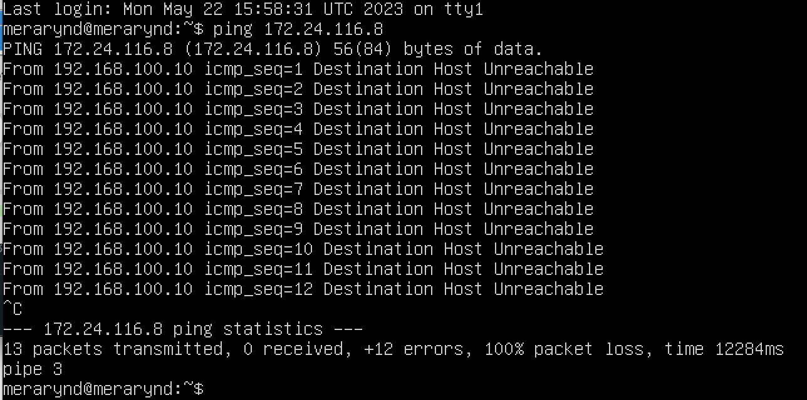
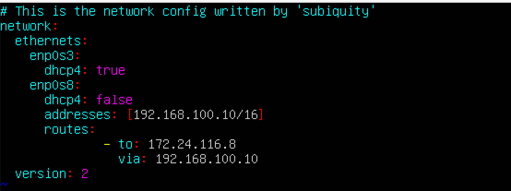
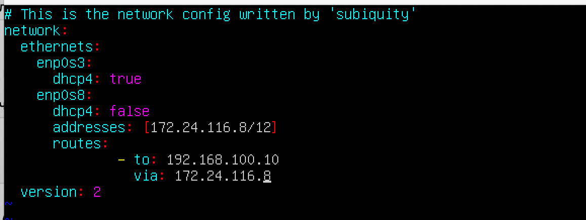
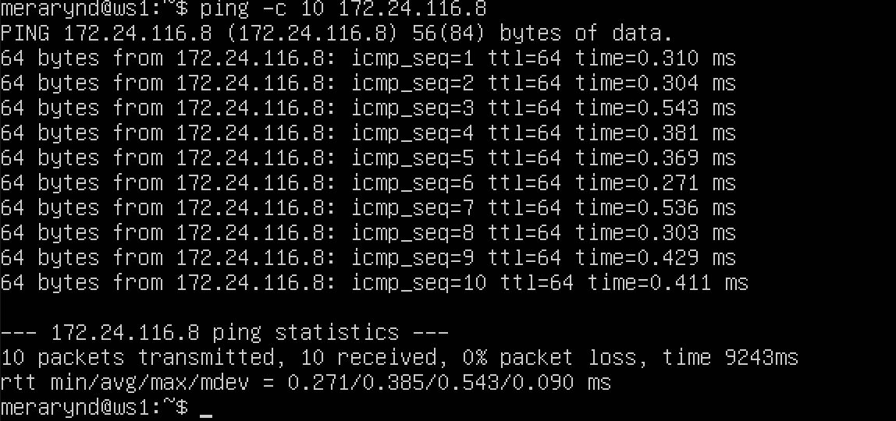
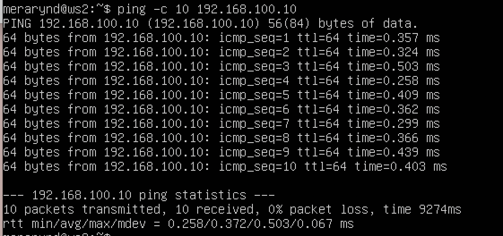

# Сети в Linux

Настройка сетей в Linux на виртуальных машинах.

## Contents

1. [Инструмент ipcalc](#part-1-инструмент-ipcalc) \
2. [Статическая маршрутизация между двумя машинами](#part-2-статическая-маршрутизация-между-двумя-машинами) \
3. [Утилита iperf3](#part-3-утилита-iperf3) \
4. [Сетевой экран](#part-4-сетевой-экран) \
5. [Статическая маршрутизация сети](#part-5-статическая-маршрутизация-сети) \
6. [Динамическая настройка IP с помощью DHCP](#part-6-динамическая-настройка-ip-с-помощью-dhcp) \
7. [NAT](#part-7-nat) \
8. [Допополнительно. Знакомство с SSH Tunnels](#part-8-дополнительно-знакомство-с-ssh-tunnels)
9. [Chapter IV](#chapter-iv)\

## Part 1. Инструмент **ipcalc**
##### Поднять виртуальную машину (далее -- ws1)
#### 1.1. Сети и маски
##### Определить и записать в отчёт:
##### 1) адрес сети *192.167.38.54/13*

` Network - 192.160.0.0/13 `

##### 2) перевод маски *255.255.255.0* в префиксную и двоичную запись, */15* в обычную и двоичную, *11111111.11111111.11111111.11110000* в обычную и префиксную

__*255.255.255.0*:__

`- Префиксная - Netmask: 255.255.255.0=24`

`- Двоичная - 11111111.11111111.11111111.00000000`

__*/15*:__

`- Обычная - Adress: 255.254.0.0`

`- Двоичная - 11111111.11111111.00000000.00000000`

__*11111111.11111111.11111111.11110000*:__

`- Oбычная - Adress: 255.255.255.240`

`- Префиксная - Netmask: 255.0.0.0 = 8`

##### 3) минимальный и максимальный хост в сети *12.167.38.4* при масках: */8*, *11111111.11111111.00000000.00000000*, *255.255.254.0* и */4*
 __*12.167.38.4* при масках */8*:__
 
 `- Минимальный хост - Xostmin: 12.0.0.1`

 `- Максимальный хост - Xostmax: 12.255.255.254`
 

 __*12.167.38.4* при масках *11111111.11111111.00000000.00000000*:__

 `- Минимальный хост - Xostmin: 12.167.0.1`

 `- Максимальный хост - Xostmax: 12.167.255.254`

 __*12.167.38.4* при масках *255.255.254.0*:__

 `- Минимальный хост - Xostmin: 12.167.38.1`

 `- Максимальный хост - Xostmax: 12.167.39.254`

 

  __*12.167.38.4* при масках */4*:__

 `- Минимальный хост - Xostmin: 0.0.0.1`

 `- Максимальный хост - Xostmax: 15.255.255.254`

 

#### 1.2. localhost
##### Определить и записать в отчёт, можно ли обратиться к приложению, работающему на localhost, со следующими IP: *194.34.23.100*, *127.0.0.2*, *127.1.0.1*, *128.0.0.1*

В википедии находим информацию localhost в диапазоне : 127.0.0.1 — 127.255.255.255.

Соответсвенно можно обратиться к приложению работающему на localhost, со следующими IP: `*127.0.0.2*,*127.1.0.1*, а с IP: *194.34.23.100*, *128.0.0.1* - нельзя.

#### 1.3. Диапазоны и сегменты сетей
##### Определить и записать в отчёт:
##### 1) какие из перечисленных IP можно использовать в качестве публичного, а какие только в качестве частных: *10.0.0.45*, *134.43.0.2*, *192.168.4.2*, *172.20.250.4*, *172.0.2.1*, *192.172.0.1*, *172.68.0.2*, *172.16.255.255*, *10.10.10.10*, *192.169.168.1*

____Публичным IP-адресом называется -____ IP-адрес, который используется для выхода в Интернет. Публичные (глобальные) IP-адреса маршрутизируются в Интернете, в отличие от частных адресов.

В связи с информацией из materials:
Следующие диапазоны адресов зарезервированы для частных (также известных как LAN) сетей:

10.0.0.0 — 10.255.255.255 ( 10.0.0.0/8 ),

172.16.0.0 — 172.31.255.255 ( 172.16.0.0/12 ),

192.168.0.0 — 192.168.255.255 ( 192.168.0.0/16 ).

127.0.0.0 — 127.255.255.255 (Зарезервировано для петлевых интерфейсов (не используется для связи между узлами сети), так называемый localhost)
Делаем вывод, что __*10.0.0.45*, *192.168.4.2*,  *172.20.250.4*, *172.16.255.255*, *10.10.10.10*__ это только для частных сетей , а остальные __*134.43.0.2*, *172.0.2.1*, *192.172.0.1*, *172.68.0.2*,*192.169.168.1*__ - можно использовать для публичных.

##### 2) какие из перечисленных IP адресов шлюза возможны у сети *10.10.0.0/18*: *10.0.0.1*, *10.10.0.2*, *10.10.10.10*, *10.10.100.1*, *10.10.1.255*

__Шлюз__ - это один из типов маршрутизаторов. Маршрутизаторы соединяют несколько сетей и выполняют функции маршрутизации пакетов. Например, некоторые маршрутизаторы передают данные по маршруту на уровне сетевого интерфейса или на физическом уровне. Шлюзы осуществляют маршрутизацию на сетевом уровне.

-Hostmin: 10.10.0.1 
-Hostmax: 10.10.63.254

 

 Из этого следует, что возможны у сети *10.10.0.0/18*: *10.10.0.2*, *10.10.10.10*, *10.10.1.255* , а невозможны *10.0.0.1*,  *10.10.100.1*.

## Part 2. Статическая маршрутизация между двумя машинами

##### Поднять две виртуальные машины (далее -- ws1 и ws2)

##### С помощью команды `ip a` посмотреть существующие сетевые интерфейсы
- В отчёт поместить скрин с вызовом и выводом использованной команды.

#####ws1

#####ws2

##### Описать сетевой интерфейс, соответствующий внутренней сети, на обеих машинах и задать следующие адреса и маски: ws1 - *192.168.100.10*, маска */16*, ws2 - *172.24.116.8*, маска */12*
- В отчёт поместить скрины с содержанием изменённого файла *etc/netplan/00-installer-config.yaml* для каждой машины.

#####ws1

#####ws2

##### Выполнить команду `netplan apply` для перезапуска сервиса сети
- В отчёт поместить скрин с вызовом и выводом использованной команды.

#####ws1

#####ws2

#### 2.1. Добавление статического маршрута вручную
##### Добавить статический маршрут от одной машины до другой и обратно при помощи команды вида `ip r add`

#####ws1

#####ws1

##### Пропинговать соединение между машинами
- В отчёт поместить скрин с вызовом и выводом использованных команд.

#####ws1

#####ws1

#### 2.2. Добавление статического маршрута с сохранением
##### Перезапустить машины
##### Добавить статический маршрут от одной машины до другой с помощью файла *etc/netplan/00-installer-config.yaml*
- В отчёт поместить скрин с содержанием изменённого файла *etc/netplan/00-installer-config.yaml*.

#####ws1

#####ws1

##### Пропинговать соединение между машинами
- В отчёт поместить скрин с вызовом и выводом использованной команды.

#####ws1

#####ws1

## Part 3. Утилита **iperf3**

`-` Теперь, когда мы связали две машины, ответь мне: что самое важное при передаче информации между машинами?

`-` Скорость соединения?

`-` Всё верно. Будем её проверять с помощью утилиты **iperf3**.

**== Задание ==**

*В данном задании используются виртуальные машины ws1 и ws2 из Части 2*

#### 3.1. Скорость соединения
##### Перевести и записать в отчёт: 8 Mbps в MB/s, 100 MB/s в Kbps, 1 Gbps в Mbps

`8 Mbps = 1 MB/s`  
`100 MB/s = 800 000 Kbps`  
`1 Gbps = 1 000 Mbps`

#### 3.2. Утилита **iperf3**
##### Измерить скорость соединения между ws1 и ws2
- В отчёт поместить скрины с вызовом и выводом использованных команд.